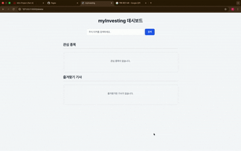
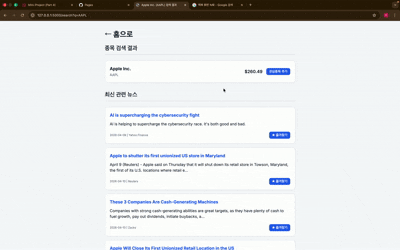
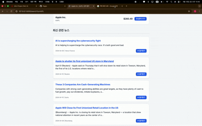

# myInvesting

> **주식 관련 유의미한 뉴스들을 수집해서 보여주는 개인 투자 보조 사이트.**

[](images/use_case.png)

---

## 2. Visual Demonstration

| 관심종목 등록 및 홈에서 조회 | 뉴스 검색 및 조회 | 뉴스에서 관심종목 등록 |
| :---: | :---: | :---: |
|  |  |  |

---

## 3. Motivation & Problem

저는 기존에 미국 주식을 주로 하는데, 한국 주식과 달리 **미국 주식에 대한 뉴스들은 직접 찾아봐야 하는 번거로움**이 있었습니다.

많은 사람들이 한국인들이 가공한 형태의 정보를 접합니다. 하지만 시간이 생명인 주식 시장의 특성상, 뉴스가 발생한 지 몇 시간 뒤에 우리가 한글로 접하게 된다면 **이미 정보의 가치는 현저히 떨어진 상태**가 됩니다. 

그래서 저는 **미국 주식에 대한 현지 뉴스를 실시간으로 생생하게 접할 수 있는 사이트**를 만들고 싶어 본 프로젝트를 시작하게 되었습니다.

---

## 4. Tech Stack & Rationale

### Backend
- **Framework: Flask** (Lightweight Web Framework)
  > 무겁지 않고 빠르며 직관적인 라우팅 설계가 가능하여 핵심 API를 신속히 구축하기에 가장 적합해 선택했습니다.
- **Data Source: yfinance** (Yahoo Finance API Wrapper)
  > 신뢰할 수 있는 야후 파이낸스의 방대한 실시간 주식 및 뉴스 데이터를 파이썬에서 간편하게 처리하기 위해 도입했습니다.
- **Language: Python 3.10**
  > 직관적인 코드 작성과 강력한 서드파티 라이브러리(데이터, 웹 등)의 폭넓은 지원을 활용하기 위해 채택했습니다.

### Frontend
- **Templating: Jinja2** (Flask default engine)
  > 별도의 셋업 없이 백엔드(Flask)가 넘겨준 주식 데이터를 빠르고 동적으로 매끄럽게 웹 화면에 렌더링하기 위해 사용했습니다.
- **Markup/Styling: HTML5, CSS3**
  > 무거운 프론트엔드 프레임워크에 의존하지 않고, 기본 기술만으로 가볍고 직관적인 UI 환경을 순수하게 구축하기 위해 선택했습니다.

### DevOps & Tools
- **Version Control: Git, GitHub**
  > 코드의 변경 이력을 체계적으로 관리하고, 향후 배포 및 기능 확장을 완벽하게 대비하기 위해 적용했습니다.
- **Environment: venv** (Virtual Environment)
  > 다른 프로젝트와의 의존성 패키지(yfinance 등) 충돌을 원천 차단하고 깔끔하고 독립적인 서버 세팅을 유지하기 위해 사용했습니다.

---

## 5. Key Features

1. **종목 검색** : 메인페이지에서 주식 티커를 통해 검색해 현재가, 기업명 등의 정보를 확인할 수 있습니다.
2. **포트폴리오 구성** : 각 종목 별 페이지에서 관심종목에 추가해 나만의 포트폴리오를 구성할 수 있습니다.
3. **대시보드 모니터링** : 메인페이지에서 등록해둔 관심종목들의 뉴스와 현재가를 한눈에 모니터링 할 수 있습니다.
4. **투자 인사이트** : 수집된 뉴스들을 직접 클릭해 원문 뉴스를 읽고 투자 인사이트를 기를 수 있습니다.

---

## 6. Getting Started Guide

### 1. Clone the repository
```bash
git clone https://github.com/TakSakong/myInvesting.git
cd myInvesting
```

### 2. Set up Virtual Environment
```bash
python3 -m venv venv
source venv/bin/activate
```

### 3. Install Dependencies
```bash
pip install -r requirements.txt
```

### 4. Run the Server
```bash
python app.py
```

### 5. Usage
- **웹 브라우저 접속** : 브라우저 주소창에 `http://localhost:5001`을 입력하여 접속합니다.
- **종목 검색 및 관리** : 
  - 검색창에 `AAPL`, `TSLA`, `NVDA` 등의 티커를 입력합니다.
  - 검색 결과에서 **관심종목 등록** 버튼을 눌러 내 리스트에 추가합니다.

---

## 7. Lessons Learned & Challenges

<details>
<summary><b>260327 수업</b></summary>
<br>
평소 개인적으로 홈페이지를 만들 때에는 Vercel이나 Railway를 이용해서 간단하게 배포했었습니다. 하지만 만약 대규모 프로젝트나 기업에서 운영하는 서비스라면 쿠버네티스(Kubernetes)를 사용하는 것이 자명하여 언젠가 쿠버네티스를 배워야겠다는 생각을 했었습니다. 이번 수업을 통해 쿠버네티스가 왜 필요한지에 대해서 자세히 배웠고, 개인적으로 어떻게 사용하는지에 대해서 깊이 공부해 봐야 할 필요성을 느꼈습니다.
</details>

<details>
<summary><b>260403 수업</b></summary>
<br>
여러 가지 유지보수에 장애물이 되는 Code Smell에 대해서 배우고, AI를 활용해 리팩토링을 빠르고 쉽게 할 수 있는 방법에 대해서 배웠습니다. 기존에는 수업에서 프로젝트를 열심히 마치고 나면 깃헙(GitHub)에서 코드가 유기되는 상태였는데, 이제는 기능 구현을 마친 후에 리팩토링을 통해 더 좋은 코드로 발전시켜나가야 한다는 인식이 확고히 자리 잡은 것 같습니다.
</details>

<details>
<summary><b>260410 수업</b></summary>
<br>
기존에는 API 기능 구현 자체에만 집중했습니다. 하지만 이제는 Docstrings를 통해 사용자에게 어떻게 사용하는지를 설명하고, 주석을 통해 왜 이런 코드를 작성했는지에 대해 고심해보게 되었습니다. 또한 이런 문서화를 응용해서 Swagger UI와 같은 API 문서를 자동으로 생성할 수 있다는 점을 새롭게 알게 되었습니다. 더불어, Sphinx를 이용해서 프로젝트의 공식 API 문서를 자동으로 생성하고 관리할 수 있다는 유용한 지식을 습득했습니다.
</details>